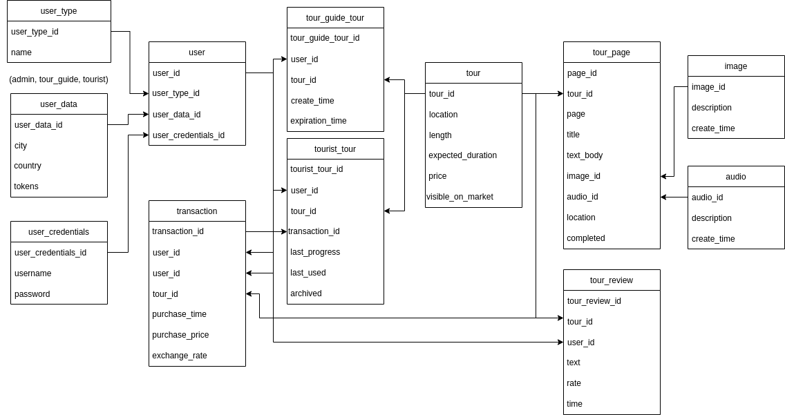

# Car classifieds
## General info

The app is intended to provide buying digital tours on its marketplace that are created by tour-guide users, advertisable through the app and can be consumed by tourist users.

## Table of Contents

  - [General info](#general-info)
  - [Features](#features)
  - [Database Model](#database-model)
  - [Tech stack](#tech-stack)
  - [Authors](#authors)

## Features

 <ul><li>Administrator<ul>
 <li>Access to account with username/email and password
 <li>Edit ads
 <li>User managment(approve user, remove user)
 </ul>
 <li>Registered users<ul>
 <li>Any registered users can deposit money for tokens or withraw tokens to get money back.
 <li>Access to account with username/email and password
 <li>Can add to favorites
 </ul>
 <li>Non-registered users<ul>
 <li>User can view content (tours) on the marketplace but cannot buy or consume any without registration.
 <li>User can register as a tour-guide or a tourist.
 </ul></ul>
 <b><h3>Search features</h3></b>
 <ul><li>Search tours
 <li>Filter search<ul>
 <li>by country
 <li>by city
 

  

## Database Model

## Tech stack

* Java
* Docker
* Spring Boot
* Thymeleaf
* MySQL

## Authors

| Name            | Github                                        |
| --------------- | --------------------------------------------- |
| Josip Čondić  | [GitHub](https://github.com/ararune)|
| Jakov Soldić  | [GitHub](https://github.com/JakovSoldic)|
| Antonio Šabić    | [GitHub](https://github.com/ansabic)|

