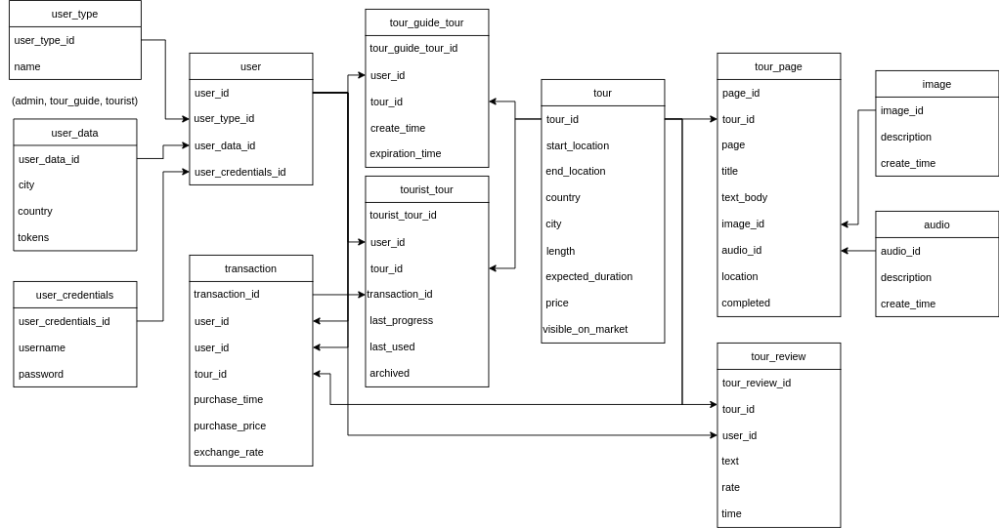

# Car classifieds
## General info

The app is intended to provide buying digital tours on its marketplace that are created by tour-guide users, advertisable through the app and can be consumed by tourist users.

## Table of Contents

  - [General info](#general-info)
  - [Features](#features)
  - [Database Model](#database-model)
  - [Tech stack](#tech-stack)
  - [Authors](#authors)

## Features

User can view content (tours) on the marketplace but cannot buy or consume any without registration.

User can register as a tour-guide or a tourist.

The only currency on the marketplace is a token. The only exchange rate is token to USD and it is dynamic. Every user is informed for every rate update via app (notifications section).

Any registered-user can deposit money for tokens or withraw tokens to get money back.

As a registered tour-guide, user can create tours and sell them for any price on the marketplace. Every tour is visible to tourists for a year but tour-guides can prolong its duration for a fixed price.

Every tour once published, is visible on the marketplace and is buyable and editable at any time. Tourist-user agrees to possible changes of a tour’s content at any time throughout its lifetime by buying it.

Once bought a tour, a tourist-user can consume/use a tour as many time as he/she wants until it expires, and the tour gets in the “archived” section where the user can only see that he owned it before. If tour’s duration gets renewed, user can consume it the same way as before.

Every tour is a segmented walkthrough. Each segment has the same fixed-form of features which can all be used but not necessarily. 
Features are: title text, normal text, picture, sound, location mark. Multi language support.

Every tour can be reviewed by any user on the marketplace in the comment section and can be given a rate (1-10) which is averaged to the total tour rate.
 

  

## Database Model

## Tech stack

* Java
* Docker
* Spring Boot
* Thymeleaf
* MySQL

## Authors

| Name            | Github                                        |
| --------------- | --------------------------------------------- |
| Josip Čondić  | [GitHub](https://github.com/ararune)|
| Jakov Soldić  | [GitHub](https://github.com/JakovSoldic)|
| Antonio Šabić    | [GitHub](https://github.com/ansabic)|

